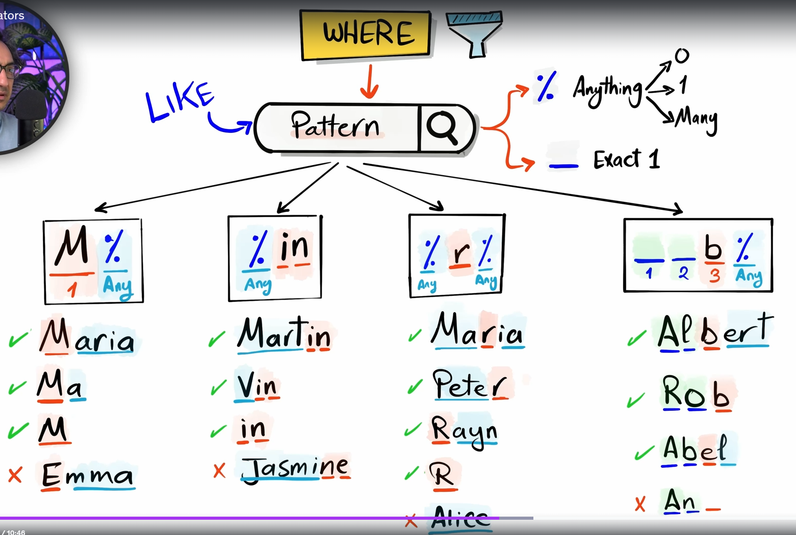

## Comparison Operators

Compare two things

'=' -> Checks if two values are **equal**

'<> !=' -> Checks if two values are **not equal**

'>' -> Checks if a value is **greater than** another value

'>=' -> Checks if a value is **greater than or equal to** another value

'<' -> Checks if a value is **less than** another value

'<=' -> Checks if a value is **less than or equal to** another value

## Logical Operators

'AND' -> All conditions must be **true**

'OR' -> At least one condition must be **true**

'NOT' -> (Reverse) Excludes matching values

## Range Operator

'BETWEEN' -> Check if a value is within a range

## Memership Operator

'IN' -> Check if a value exists in a list

## Search Operator

'LIKE' -> Search for a pattern in text

Patterns:

- '%' -> anything
- '_' -> exactly one

