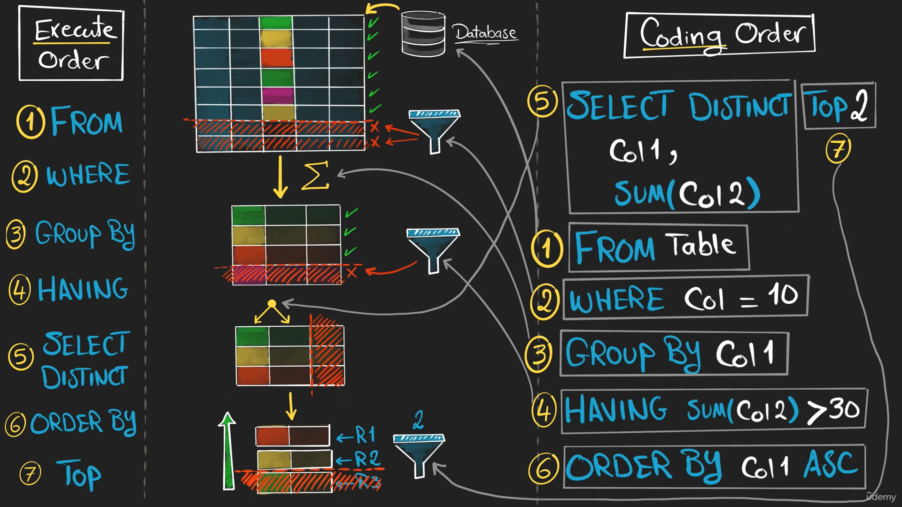

## Components of SQL

```sql
    -- Retrieve Customers data
    SELECT
        name,
        LOWER(country)
    FROM customers
    WHERE country = 'Italy'
```

The first line in green is a comment, that is not executed by SQL, it is just a way to explain the statement.

The query is separated in three main sections called 'Clauses' (SELECT, FROM, WHERE), those clauses have a specific task.

The uppercase words are the standard keywords from SQL. They could be a command or a operator.

The lowercase words (normal) are the identifiers, they are names of columns or tables.

## What is SQL Query

SQL Query is the way we ask data to our Database.

## SELECT & FROM

```sql
    SELECT *
    -- Retrieves All Columns (everything)
    FROM Table
    -- Tells SQL where to find your data
```

```sql
    SELECT Col1, Col2
    -- Pick only the Columns you need
    FROM Table
    -- Tells SQL where to find your data
```

## WHERE

Filters data based on a Condition

```sql
    SELECT Col1, Col2
    FROM Table
    WHERE Condition
```

## ORDER BY

Sort data Asc or Desc

```sql
    SELECT *
    FROM Table
    ORDER BY Column ASC/DESC
```

If it is not writen ASC or DESC, ORDER BY will order by default ASC. But it is better to write ASC for clarity.

### Nested sorting

```sql
    SELECT *
    FROM Table
    ORDER BY
        Column 1 ASC/DESC,
        Column 2 ASC/DESC
```

## GROUP BY

Combine rows with the same value. Aggregates a Column by another Column

```sql
    SELECT Col 1,
        SUM(Col 2) AS alias
    FROM Table
    GROUP BY Col 1
```

All columns in the SELECT must be eiter aggregated or included in the GROUP BY

## HAVING

Filters data after aggregation, can be used only with GROUP BY

```sql
    SELECT Col 1,
        SUM(Col 2) AS alias
    FROM Table
    GROUP BY Col 1
    HAVING alias Condition
```

If you want to want to filter the data Before the aggregation we must use WHERE, but if you want to filter the data After the aggregation we must use HAVING

## DISTINCT

Removes duplicates (repeated values)

```sql
    SELECT DISTINCT Col 1,
    FROM Table
```

## TOP (LIMIT)

Restrict the number of rows returned

```sql
    SELECT TOP n Col 1,
    FROM Table
```

```sql
    -- MySql
    SELECT country
    FROM customers
    LIMIT n
```

## Coding order vs Execution order

