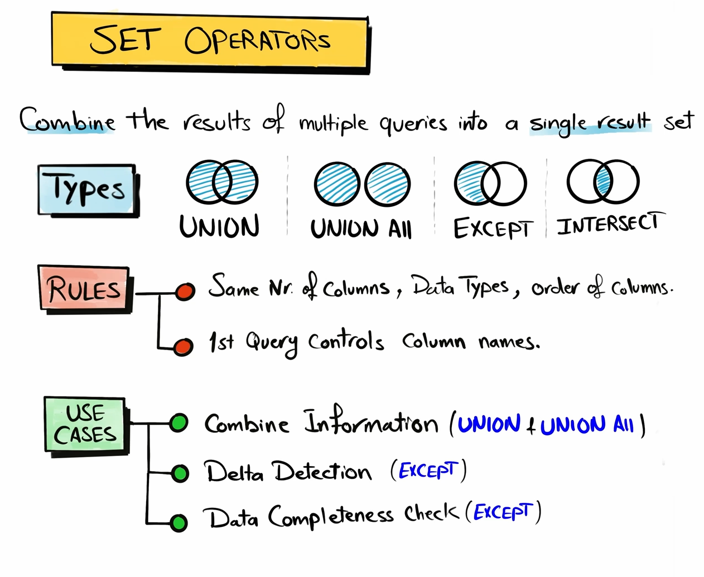

## UNION

Returns all district rows from both queries. Removes duplicate rows from the result

```sql
    SELECT *
    FROM Table_a

    UNION

    SELECT *
    FROM Table_b
```

## UNION ALL

Returns all district rows from both queries, including duplicates. It is generally faster than UNION.

```sql
    SELECT *
    FROM Table_a

    UNION ALL

    SELECT *
    FROM Table_b
```

## EXCEPT

Returns all distinct rows from the first query that are not found in the second query.

It is the only one where the order of queries affects the final result.

```sql
    SELECT *
    FROM Table_a

    EXCEPT

    SELECT *
    FROM Table_b
```

## INTERSECT

Returns only the rows that are common in both queries

```sql
    SELECT *
    FROM Table_a

    INTERSECT

    SELECT *
    FROM Table_b
```



