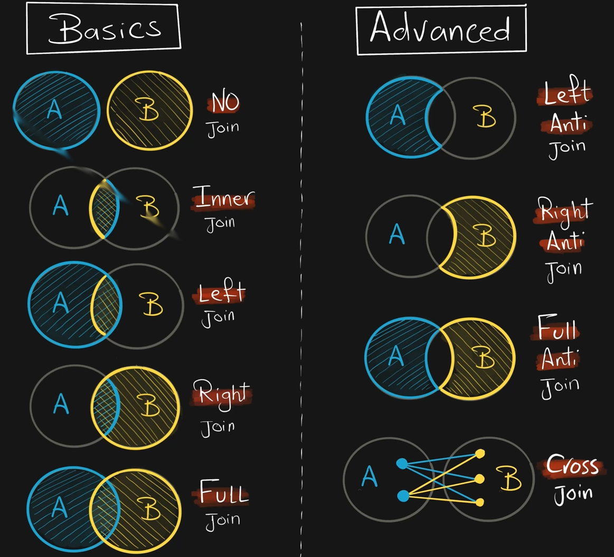
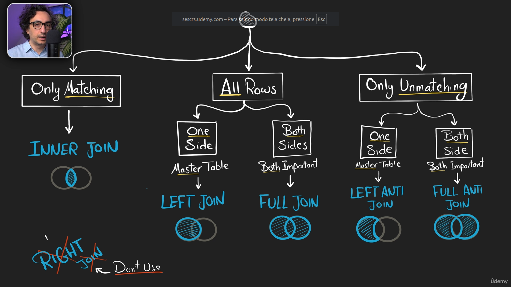

## Whas is SQL Joins

Connect two tables based on a key column.

## When to use Join

1. Recombine Data
2. Data Enrichment 'Getting Extra Data'
3. Check for Existence 'Filtering'

## Join Types



## NO JOIN

Returns data from table without combing them

```sql
    SELECT *
    FROM Table_a;

    SELECT *
    FROM Table_b;
```

## INNER JOIN

Returns only the matching rows from both tables. It is the default type

```sql
    SELECT *
    FROM Table_a
    [INNER] JOIN Table_b
    ON Table_a.key = Table_b.key
```

## LEFT JOIN

Returns all rows from left table and only the matching data from right table

```sql
    SELECT *
    FROM Table_a (left table)
    LEFT JOIN Table_b (right table)
    ON Table_a.key = Table_b.key
```

## RIGHT JOIN

Returns all rows from right table and only the matching data from left table

```sql
    SELECT *
    FROM Table_a (left table)
    RIGHT JOIN Table_b (right table)
    ON Table_a.key = Table_b.key
```

## FULL JOIN

Returns all rows from both tables

```sql
    SELECT *
    FROM Table_a
    FULL JOIN Table_b
    ON Table_a.key = Table_b.key
```

## LEFT ANTI JOIN

Returns row from left that has NO MATCH in right

```sql
    SELECT *
    FROM Table_a (left table)
    LEFT JOIN Table_b (right table)
    ON Table_a.key = Table_b.key
    WHERE Table_b.key IS NULL
```

## RIGHT ANTI JOIN

Returns row from right that has NO MATCH in left

```sql
    SELECT *
    FROM Table_a (left table)
    RIGHT JOIN Table_b (right table)
    ON Table_a.key = Table_b.key
    WHERE Table_a.key IS NULL
```

## FULL ANTI JOIN

Returns only rows that do not match in either tables

```sql
    SELECT *
    FROM Table_a (left table)
    FULL JOIN Table_b (right table)
    ON Table_a.key = Table_b.key
    WHERE Table_a.key IS NULL
        OR Table_b.key IS NULL
```

## CROSS JOIN

Combines every row from left with every row from right. All possible combinations (Cartesian Join)

```sql
    SELECT *
    FROM Table_a (left table)
    CROSS JOIN Table_b (right table)
```

## How to choose the correct JOIN


